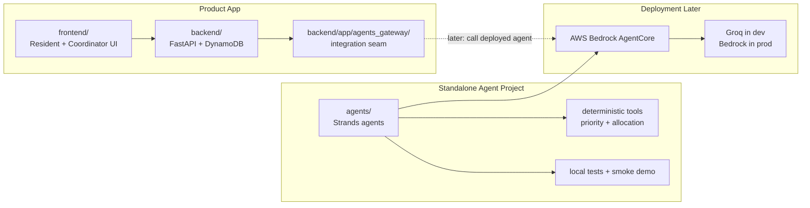
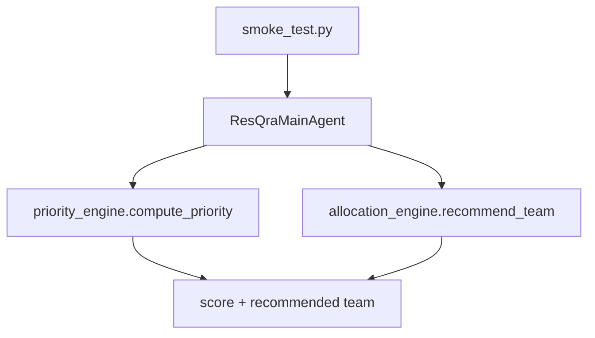
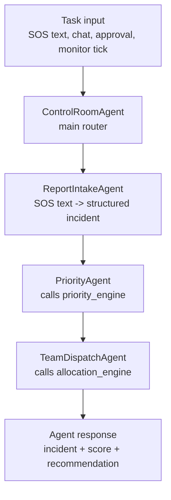
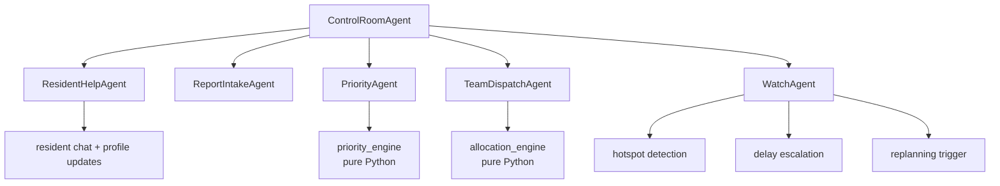
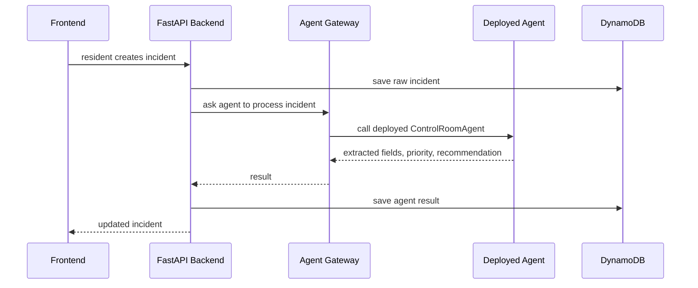

# ResQra Agents

Standalone Strands-agent project for ResQra.

This folder is where we build and test the agent brain before connecting it
to the real product backend.

---

## 1. The Simple Mental Model

ResQra has four different areas:

| Folder | What it is | What it should do |
|---|---|---|
| `backend/` | Real FastAPI product backend | Auth, DynamoDB, API routes, product state |
| `frontend/` | Real React product UI | Resident app and coordinator console |
| `experimentation/` | Senior's reference/prototype | Learn from it and port ideas carefully |
| `agents/` | Standalone Strands agent project | Build, test, deploy the agent brain |

The important rule:

```text
Do not mix agent-building with backend-building too early.
Build agents here first. Deploy them. Then connect backend to the deployed agent.
```

---

## 2. Big Flow



Meaning:

1. The product app works through `frontend/` and `backend/`.
2. The agent project is built separately inside `agents/`.
3. After the agent is useful and tested, we deploy it.
4. Only after deployment do we make `backend/app/agents_gateway/gateway.py` call the deployed agent.

---

## 3. Why This Folder Exists

If we put all agent files directly inside the backend too early, things get
foggy:

- Is the backend responsible for rescue state?
- Is the agent responsible for rescue state?
- Are we testing product APIs or agent behavior?
- Can we deploy the agent without deploying the whole backend?

The clean answer:

```text
backend = product state and APIs
agents = decision/reasoning brain
agents_gateway = bridge between them
```

This gives us a deployable agent project and a stable product backend.

---

## 4. Current Agent Folder

```text
agents/
  README.md
  AGENT_PLAN.html
  requirements.txt
  smoke_test.py
  demo_agent.py
  demo_approval.py
  resqra_agents/
    __init__.py
    main_agent.py
    agents/
      __init__.py
      control_room.py
      report_intake.py
      priority.py
      team_dispatch.py
      resident.py
      monitor.py        (WatchAgent)
    tools/
      __init__.py
      geo.py
      priority_engine.py
      allocation_engine.py
      pending_actions.py
      mission_store.py
      activity_log.py
```

### `requirements.txt`

Dependencies for the standalone agent project.

Current dependencies:

- `strands-agents`: target agent framework.
- `groq`: low-cost/free development model provider.
- `python-dotenv`: lets us load `.env` later.

### `smoke_test.py`

A tiny local proof that the agent base works:

```text
fake incident + fake teams -> priority score -> team recommendation
```

This does not need Groq or AWS. That is deliberate.

### `resqra_agents/main_agent.py`

The current main entry point.

It has:

- `score_incident(...)`
- `recommend_team(...)`
- `dispatch(...)`
- lazy `build_strands_agent(...)` for later real Strands runtime

Right now it is a local five-agent base. It can process a demo SOS, score it,
recommend a team, answer a resident chat in degraded mode, and run a simple
monitor sweep. It is not deployed yet.

### `resqra_agents/tools/priority_engine.py`

Calculates incident priority with deterministic code.

It uses:

- urgency
- people count
- vulnerabilities
- waiting time
- area pressure
- river/weather risk

LLMs must not calculate this number.

### `resqra_agents/tools/allocation_engine.py`

Recommends a rescue team with deterministic code.

It checks:

- team status
- team capacity
- distance from incident
- rejected team/incident pairs

LLMs must not invent teams, distances, ETAs, or capacity.

### `resqra_agents/tools/pending_actions.py`

The approval gate. A `PendingActionsStore` owns the card state machine:

```text
PENDING -> APPROVED | REJECTED | SUPERSEDED
```

Deciding a card twice is a no-op (idempotent), and a `RejectionMemory`
stores `(team_id, incident_id)` pairs so the allocation engine never
re-proposes a rejected team for the same incident.

### `resqra_agents/tools/mission_store.py`

Missions are created only after an approval. The mission payload links
`incident_id`, `team_id`, and the `pending_action_id` that authorized it.

### `resqra_agents/agents/monitor.py` (WatchAgent)

The scheduled sweep: hotspot clustering by geohash, escalation timers for
incidents waiting too long, capacity shortage checks, and team disruption
detection. With `replan=True` it converts findings into PENDING approval
cards for unassigned high-priority incidents — monitoring feeds the same
human-gated loop as everything else.

---

## 5. Current Agent Flow

This is what works now:



This is the old smallest proof. The stronger proof is now `demo_agent.py`,
which runs the first architecture slice end to end.

---

## 6. Target Agent Flow

This is now built as the first local architecture slice:



Minimum useful demo:

```text
SOS text
  -> structured incident
  -> priority score
  -> team recommendation
  -> explanation
```

When that works in `agents/`, we can think about deployment.
This flow now works through `python agents/demo_agent.py`.

---

## 7. Future Full Agent System

The local five-agent base now looks like this:



Keep the agent names plain:

| Agent | Meaning |
|---|---|
| `ControlRoomAgent` | Main router and approval enforcer |
| `ReportIntakeAgent` | Reads SOS text and extracts structured data |
| `PriorityAgent` | Scores incidents through deterministic code |
| `TeamDispatchAgent` | Recommends teams through deterministic code |
| `ResidentHelpAgent` | Chats with residents and updates profile facts |
| `WatchAgent` | Monitors hotspots, delays, failures, and replans |

These agents now exist as a local base. The next work is not another name;
the next work is approval state and better LLM-backed intake.

---

## 8. What Uses LLM And What Does Not

This is the safety line.

| Work | LLM? | Why |
|---|---|---|
| Extracting fields from messy SOS text | Yes | Language understanding |
| Talking to a resident | Yes | Human conversation |
| Summarizing monitor findings | Yes | Explanation and wording |
| Routing a task to an agent | Maybe | Nice later, but code fallback is enough |
| Priority score | No | Must be deterministic and testable |
| Team distance | No | Math |
| ETA | No | Math |
| Capacity check | No | Safety-critical rule |
| Dispatch execution | No | Must be approval-gated code |

In short:

```text
LLM reads and explains.
Python calculates and executes.
Human approves dispatch.
```

---

## 9. Groq vs AWS Bedrock

### Development

Use Groq first.

Why:

- cheaper
- faster setup
- good enough for prompt testing
- avoids burning AWS credits early

Environment:

```bash
GROQ_API_KEY=...
GROQ_MODEL=openai/gpt-oss-120b
```

### Production / Hackathon Demo

Use AWS Bedrock or AgentCore when the agent is stable.

Why:

- matches AWS hackathon direction
- deployable agent runtime
- cleaner final architecture story

But do not deploy a skeleton too early. Deploy after the minimum demo works.

---

## 10. Build Order From Here

The first version of this order is now built locally.

### Step 1: Build `ControlRoomAgent`

Goal:

```text
main_agent.dispatch(task) routes to the right local agent class
```

Needed task types:

```json
{"type": "new_distress_msg", "raw_text": "..."}
{"type": "score_incident", "incident": {...}}
{"type": "recommend_team", "incident": {...}, "teams": [...]}
```

Why first:

- it becomes the one door into the agent system
- every future agent plugs into it

### Step 2: Build `ReportIntakeAgent`

Goal:

```text
raw SOS text -> structured incident dict
```

Example input:

```text
6 people stuck near Kankarbagh school, water rising, 2 children
```

Example output:

```json
{
  "people": 6,
  "urgency": "HIGH",
  "vulnerabilities": ["children"],
  "water_rising": true,
  "location_text": "Kankarbagh school"
}
```

Why second:

- priority needs structured fields
- dispatch needs people count and location

### Step 3: Wrap `PriorityAgent`

Goal:

```text
structured incident -> priority score
```

This is mostly a wrapper around `priority_engine.py`.

Why:

- lets the architecture say "agent" while keeping math deterministic

### Step 4: Wrap `TeamDispatchAgent`

Goal:

```text
incident + teams -> recommended team + reasons
```

This is mostly a wrapper around `allocation_engine.py`.

Why:

- gives the coordinator a useful recommendation
- later it will create `PendingActions`

### Step 5: One End-To-End Local Demo

Goal:

```text
python demo_agent.py
```

Should show:

```text
Input SOS:
6 people stuck near Kankarbagh school, water rising, 2 children

Extracted:
people=6, urgency=HIGH, vulnerabilities=children

Priority:
HIGH, score 8

Recommendation:
TEAM BETA, capacity 15, nearest eligible team
```

This step now works locally. Deployment starts making sense after we add
approval state and one Groq-backed extraction test.

---

## 11. When To Deploy

Do not deploy yet.

Deploy only after these are true:

- `ControlRoomAgent` exists.
- `ReportIntakeAgent` exists.
- `PriorityAgent` works.
- `TeamDispatchAgent` works.
- A local demo proves SOS text to recommendation.
- There is at least one smoke test that passes without cloud.
- There is one optional LLM test with Groq.
- Approval cards exist as data, not just text.

Then deploy.

The first five-agent base and the approval gate are now built — approval
cards are real state (`PendingActionsStore`), missions only exist after an
APPROVE, and rejection memory is enforced. Remaining before deployment:
the Groq-backed intake path and a `/tasks` HTTP wrapper for the runtime.

---

## 12. Backend Integration Later

The backend should integrate through:

```text
backend/app/agents_gateway/gateway.py
```

Later flow:



Backend responsibility:

- auth
- database writes
- API contracts
- public/private data safety

Agent responsibility:

- language understanding
- reasoning flow
- recommendations
- summaries

---

## 13. Commands

Install:

```bash
cd agents
python -m venv .venv
.venv/Scripts/activate
pip install -r requirements.txt
```

Run smoke test:

```bash
python smoke_test.py
```

Expected:

```text
agent smoke ok
```

---

## 14. What Exists Now

Built now:

```text
agents/resqra_agents/agents/control_room.py      router + approval gate + executor
agents/resqra_agents/agents/report_intake.py     SOS text -> structured incident
agents/resqra_agents/agents/priority.py          deterministic scoring wrapper
agents/resqra_agents/agents/team_dispatch.py     deterministic recommendation wrapper
agents/resqra_agents/agents/resident.py          resident chat shell
agents/resqra_agents/agents/monitor.py           WatchAgent sweep + replan cards
agents/resqra_agents/tools/pending_actions.py    approval gate + rejection memory
agents/resqra_agents/tools/mission_store.py      missions (approval-gated)
agents/resqra_agents/tools/activity_log.py       agent activity timeline
agents/demo_agent.py                             five-agent pipeline demo
agents/demo_approval.py                          approve/reject/replan demo
```

Definition of done:

```text
python agents/demo_agent.py
```

prints:

```text
SOS text -> extracted incident -> priority score -> team recommendation
```

That is the next real milestone.

## 15. What To Build Next

The approval gate is now built and verified:

```text
python agents/demo_approval.py
```

shows the full rule end to end:

```text
SOS text -> recommendation card -> REJECTED -> team never proposed again
                                -> APPROVED -> mission payload + team ON_MISSION
double approve -> idempotent no-op
WatchAgent sweep (replan) -> auto-created approval cards
```

The backend already integrates this brain in dev mode through
`backend/app/agents_gateway/gateway.py`: new incidents are scored by the
PriorityAgent on creation, `/api/ops/incidents/{id}/recommend` delegates to
TeamDispatchAgent, and rejected pending actions are honored. After the agent
is deployed, set `resqra_agent_url` in the backend `.env` and the same seams
call the deployed runtime instead.

Next build items:

1. One Groq-backed `ReportIntakeAgent` path (LLM extraction with the local
   parser kept as degraded mode).
2. Deployment packaging for the agent (container + `/tasks` HTTP endpoint).
3. Simulation event inputs (`/api/sim/events`).

Definition of done for deployment readiness:

```text
SOS text -> structured incident -> priority -> card -> APPROVE -> mission
works both standalone (demo_approval.py) and through the real backend API.
```
